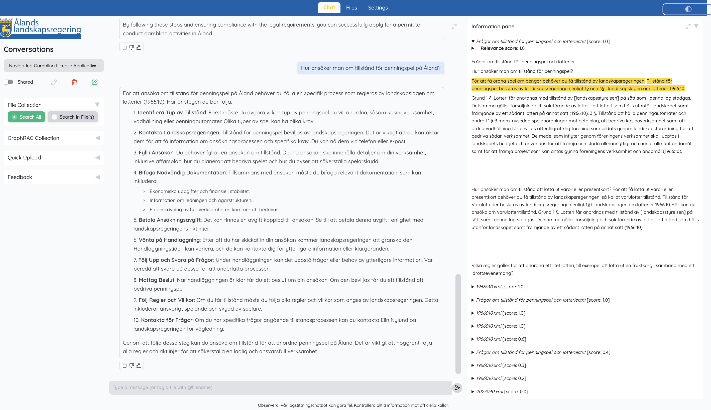
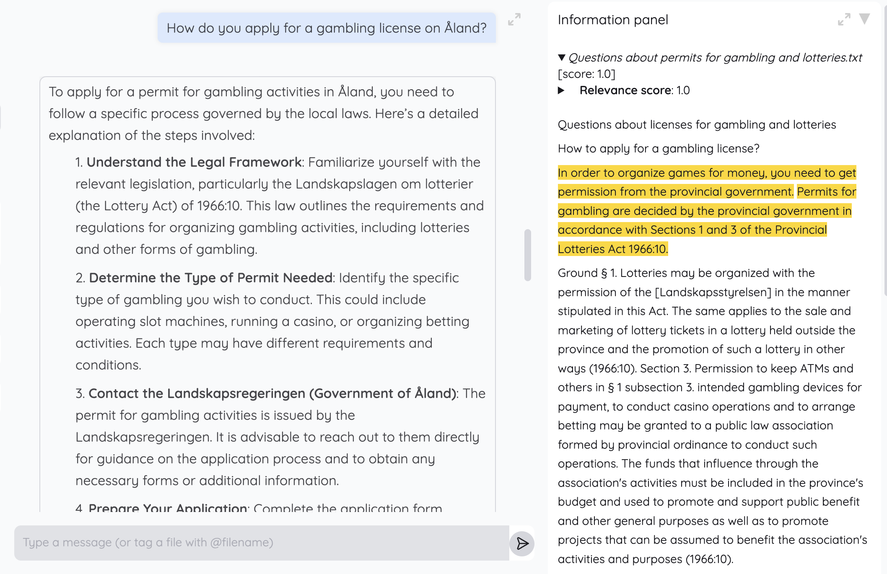

<div align="center">

# ÅlexGPT Introduction

Welcome to ÅlexGPT. This project is designed to make legal information more accessible on Åland, by providing context-aware answers to questions specific to Åland's laws and regulations. Built with both end users and developers in mind.





[](https://www.python.org/downloads/release/python-31013/)
[](https://www.langchain.com/)
[](https://github.com/gradio-app/gradio)
[](https://cinnamon.github.io/kotaemon/development/#for-developers)
[](https://github.com/psf/black)
[](https://opensource.org/licenses/MIT)

</div>

<!-- start-intro -->

## Key Features

- **Interactive QA Web-UI**:  
Document-based chatbot tailored to Åland's legal documents. Features include multi-user login, private/public collections, and collaboration tools.

- **LLM & Embedding Model Integration**: Integrate with local models or popular APIs like OpenAI to power legal question-answering capabilities.

- **Hybrid RAG pipeline**: Combines full-text and vector-based retrieval for high-quality responses. The pipeline is optimized to handle complex legal documents effectively.

- **Multi-modal Document support**: Perform Question Answering on Åland's legal documents, including support for parsing tables, figures, and other structured content. Handles diverse document types, including tables, figures, and structured content, for advanced question-answering scenarios.

- **Advanced citations with document preview**: Provides detailed citations to ensure the accuracy of responses along with `Relevance Score`. Citations are viewable directly in an in-browser PDF viewer, with highlights for easy reference.

### System requirements

1. [Python](https://www.python.org/downloads/) >= 3.10
- Required to run the application and its dependencies.
2. [Docker](https://docker.com/) (Optional)  
- Recommended for containerized deployment. Follow the Docker installation instructions for a simplified setup process.  
3. [Unstructured](https://docs.unstructured.io/open-source/installation/full-installation#full-installation) (Optional)- Required if you want to process files other than `.pdf`, `.html`, `.mhtml`, and `.xlsx` documents. Installation steps may vary by operating system; refer to the provided link for details.

## Table of Contents
1. [Quick Start](#quick-start) Installation with Docker (recommended)
2. [Without Docker](#without-docker)
3. [Citation](#citation)
4. [Contributions](#contributions)
5. [Changelogs](#changelogs)


## Quick Start 
### Installation with Docker (recommended)
Follow these steps to get started with ÅlexGPT:
1. Clone the repository:  
```bash
git clone https://github.com/digi-regeringen-ax/AlexGPT-2.git
cd AlexGPT-2
```
2. Run the Setup Script:
Install necessary dependencies and prepare the environment using the provided setup script:
```bash
bash setup.sh
```
3. Create a `.env` File:
In the root directory, create a .env file and add your OpenAI API key:
```bash 
OPENAI_API_KEY=<your_openai_api_key>
```
4. Start the Application:
Launch the application using Docker Compose:
```bash 
docker-compose up
```
5.  Access the WebUI:
Once the setup is complete, access the ÅlexGPT WebUI by navigating to http://localhost:9999 in your browser.

### Notes:
- Configuration: Ensure all required environment variables (e.g., `OPENAI_API_KEY`) are correctly set in `.env.local`.

- For troubleshooting, review the logs by running:
```bash 
docker compose logs -f
```
- Stopping the Application / To stop the running containers: 
```bash
docker compose down
```

### Without Docker
Follow these steps to set up and run ÅlexGPT manually:

1. Set Up Python Environment.  
Create a fresh Python environment and install the necessary dependencies:
```bash 
# Optional: Create a virtual environment
python -m venv venv
source venv/bin/activate  # On Windows: venv\Scripts\activate

# Clone the repository
git clone https://github.com/digi-regeringen-ax/AlexGPT-2.git
cd AlexGPT-2

# Install dependencies
pip install -e "libs/kotaemon[all]"
pip install -e "libs/ktem"
``` 

2. Create a `.env` File.  
Copy the `.env.example` file and rename it to `.env`. Update the file with your specific environment variables, such as API keys:
```bash 
cp .env.example .env
```
Ensure your `.env` file includes:
```bash
OPENAI_API_KEY=<your_openai_api_key>
``` 

4.  Start the application:
Run the application
   ```bash
   python app.py
   ```

- Once the server starts, open your browser and navigate to http://localhost:9999.

- Default credentials are:  
  Username: `admin`  
  Password: `admin`  

#### Notes:
Python Version: Make sure you are using Python >= 3.10.
- Troubleshooting: If dependencies fail to install, ensure your requirements.txt file is complete. Regenerate it if needed:
```bash
pip freeze > requirements.txt
```
- Stopping the Application: To stop the server, use Ctrl+C in the terminal or close the terminal window.

## Citation
If you build upon ÅlexGPT, please use the following citation:
```BibTeX
@misc{alexgpt2024,
    title = {ÅlexGPT - Legislation Buddy on Åland's legal information},
    author = {The ÅlexGPT Team at Digitaliseringsenheten},
    year = {2025},
    howpublished = {\url{https://github.com/digi-regeringen-ax/AlexGPT-2}},
}
```

## Contributions
Created by :  
[Jimmy](https://github.com/jimmy7294) | [Jere](https://github.com/j4b5) | [Korin](https://github.com/blueskiy01)  

## Changelogs
Stay up to date with the latest changes and improvements: [View Changelogs](https://github.com/digi-regeringen-ax/AlexGPT-2/releases).